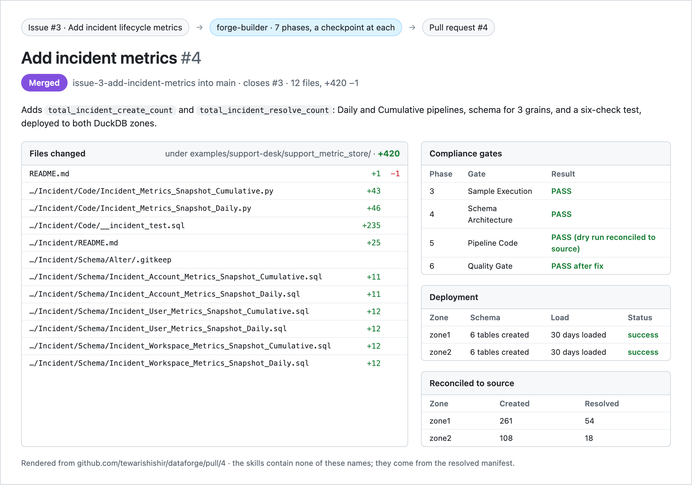
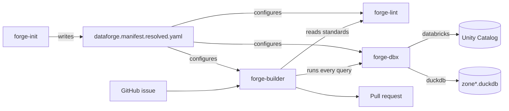

# dataforge

[](LICENSE)
[](https://github.com/tewarishishir/dataforge/releases/tag/v0.1.0)
[](https://github.com/tewarishishir/dataforge/discussions)

Four agent skills that build data pipelines, with no knowledge of your data in
any of them.

Everything the skills need to know about a specific business — its zones,
catalogs, domains, entities, grains, job names, and naming grammar — lives in
one generated manifest. The skills read it. They never contain it. That
boundary is what makes the same skills work across two different data
platforms, and it is also why this repository could be published at all.

[](https://github.com/tewarishishir/dataforge/pull/4)

That is a real run. [Issue #3](https://github.com/tewarishishir/dataforge/issues/3)
asked for incident metrics; `forge-builder` produced
[pull request #4](https://github.com/tewarishishir/dataforge/pull/4). Run it
yourself with [DEMO.md](examples/support-desk/DEMO.md).

```bash
brew install duckdb
cd examples/support-desk && python seed.py
```

Then point your agent at that directory and say `initialize dataforge`. No
cloud account, no cluster, no credentials. [DEMO.md](examples/support-desk/DEMO.md)
walks the whole thing from a GitHub issue to a pull request.

## The skills

| Skill | Does | Read |
| --- | --- | --- |
| [`forge-init`](skills/forge-init/) | Turns an eight-line seed config into the full project manifest by inspecting the warehouse and the codebase | [SKILL.md](skills/forge-init/SKILL.md) |
| [`forge-dbx`](skills/forge-dbx/) | One interface over the data platform: auth, queries, jobs, catalogs. Databricks or DuckDB | [SKILL.md](skills/forge-dbx/SKILL.md) |
| [`forge-lint`](skills/forge-lint/) | The standards — naming, SQL formatting, join strategy, safety gates — as a skill rather than a wiki page | [SKILL.md](skills/forge-lint/SKILL.md) |
| [`forge-builder`](skills/forge-builder/) | Composes the other three into a seven-phase build, issue to PR, with a human checkpoint at each phase | [SKILL.md](skills/forge-builder/SKILL.md) |



## Four ideas worth stealing

**A config boundary, enforced.** One file holds the business context; no skill
hardcodes a catalog, a table, or a domain word. The test is whether you can
open-source the skills without a rewrite. These passed it.

**Discovery over declaration.** `forge-init` infers grains from schema
filenames and metric grammar from existing pipeline code, rather than asking a
human to write it down twice. What it cannot discover, it marks unsupported
instead of guessing.

**One execution primitive.** Every query in every skill goes through
`forge-dbx`. Swapping Databricks for DuckDB is a one-line manifest change
because nothing else ever learned what a platform is.

**Rules as a skill, not a document.** `forge-lint` is loaded before any code is
written, so the standards are an input to generation rather than a comment left
on the pull request afterward.

## Install

The skills are plain Markdown and work with any agent that can read files.

```bash
git clone https://github.com/tewarishishir/dataforge.git
```

Claude Code can install from this repository directly:

```bash
claude plugin marketplace add tewarishishir/dataforge
claude plugin install dataforge@dataforge
```

| Agent | Points at |
| --- | --- |
| Claude Code | `.claude-plugin/plugin.json` |
| Cursor | `.cursor-plugin/plugin.json` |
| GitHub Copilot | `.github/agents/*.agent.md` |

The agent packages and `.claude-plugin/marketplace.json` are generated from
`skills/*/SKILL.md` by `node scripts/package.mjs`. CI fails if they drift, so
the source stays single.

## Status

Beta. The DuckDB adapter and the GitHub Issues intake are new in
[`0.1.0`](https://github.com/tewarishishir/dataforge/releases/tag/v0.1.0) and
are exercised by the example project rather than by production use.

- [Changelog](CHANGELOG.md)
- [Contributing](CONTRIBUTING.md)
- [Adopters](ADOPTERS.md)
- [Cite this project](CITATION.cff)
- [Discussions](https://github.com/tewarishishir/dataforge/discussions)

MIT licensed.
